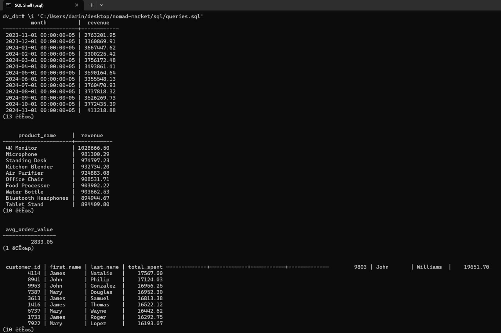
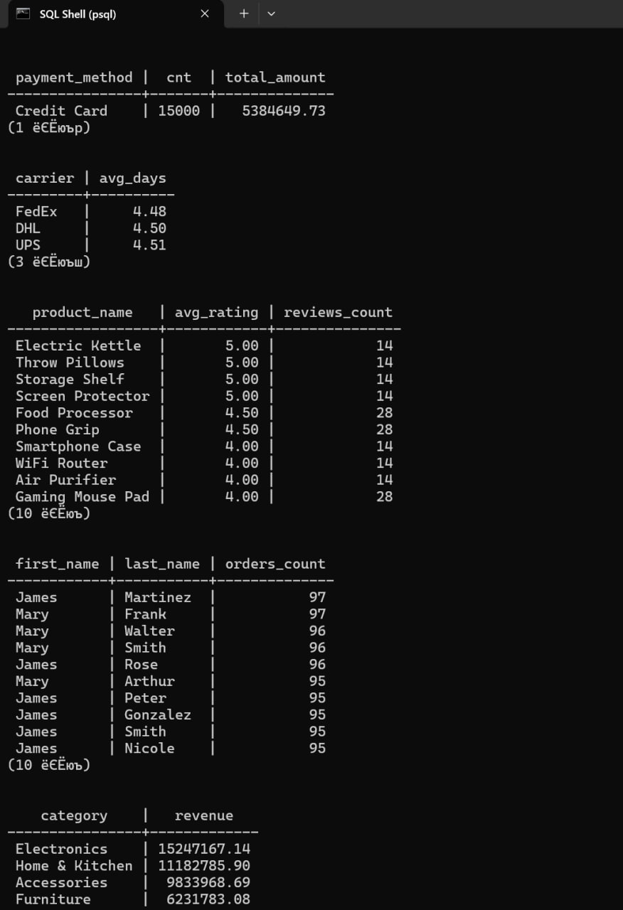
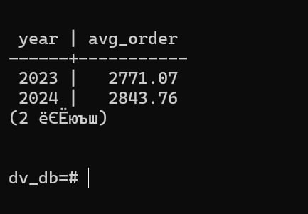
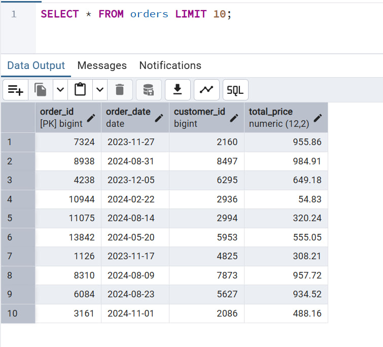
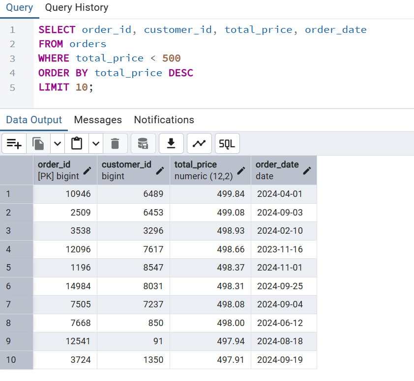
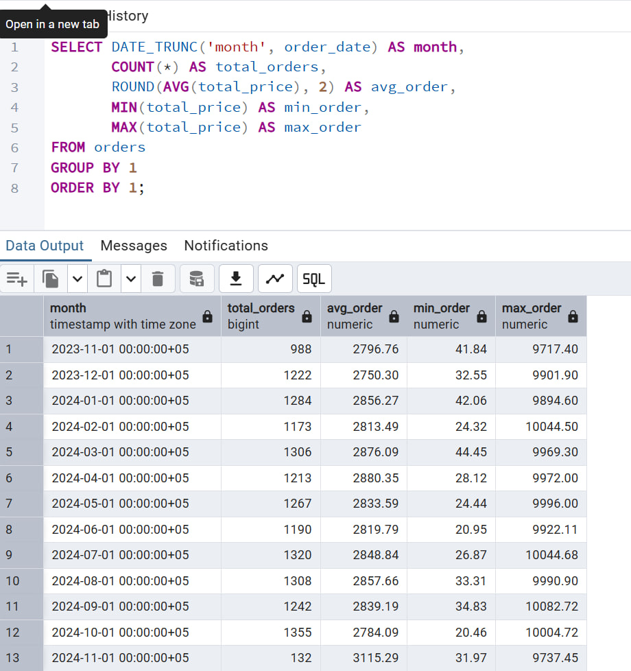
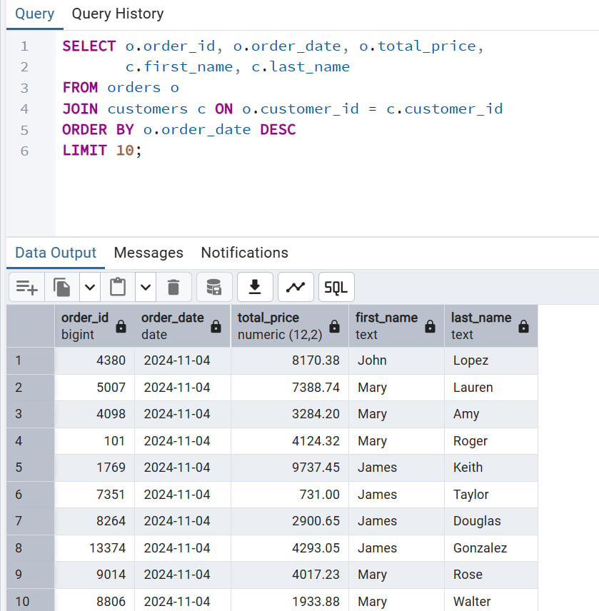
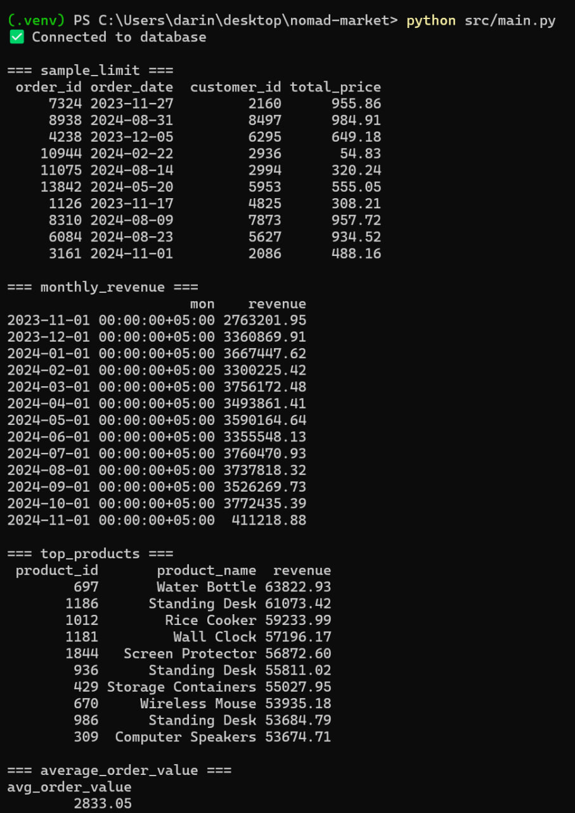
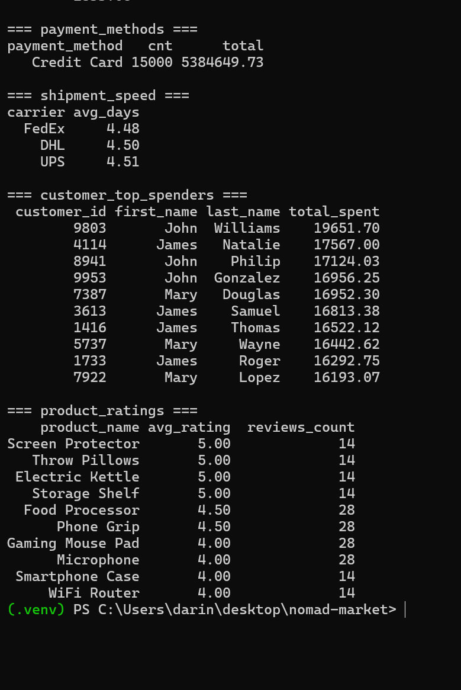

# NOMAD MARKET

## About the Company
**Nomad Market** is an e-commerce platform that sells furniture, office supplies, and electronics from different suppliers to thousands of customers across Central Asia.  
As a data analyst in this project, I explore customer behavior, sales performance, payments, shipments, and product reviews.

---

## Project Overview
This project demonstrates how to:
- Build a relational database in PostgreSQL,
- Design an ER diagram with primary and foreign keys,
- Import and clean data from multiple CSV files,
- Run SQL queries (filtering, aggregation, joins),
- Perform 10 analytical queries for business insights,
- Automate analysis with a Python script,
- Visualize results with Apache Superset (or Python).

---
### Tools and Resources

**PostgreSQ**L – database management

**pgAdmin 4** – DB inspection and ERD

**Python** – scripts and data analysis

pandas, psycopg2, SQLAlchemy, dotenv

**Matplotlib / Seaborn / Plotly** – visualization in Python

**Apache Superset** – dashboard creation

**VS Code** – development environment

**GitHub** – version control and project hosting

---

## Screenshots
### ER Diagram


### Main Analytics Example




---

## Some SQL queries and small Python script from main.py








---

## How to Run the Project

1. **Download the project**
   Clone the repository from GitHub and go to the project folder:

```bash
git clone https://github.com/<your_username>/silk-road-retail-insights.git
cd silk-road-retail-insights
```

2. **Set up the environment**
   Create a virtual environment and install dependencies:

```bash
python -m venv .venv
.venv\Scripts\activate   # Windows
source .venv/bin/activate  # Linux/Mac

pip install -r requirements.txt
```

3. **Configure the database**

* Create a new database in PostgreSQL:

  ```sql
  CREATE DATABASE dv_db;
  ```
* Update your `.env` file with PostgreSQL login/password.

4. **Create tables and load data**
   Run the SQL scripts:

```bash
psql -h 127.0.0.1 -U postgres -d dv_db -f sql/ddl.sql
psql -h 127.0.0.1 -U postgres -d dv_db -f sql/import.sql
```

5. **Check the data**
   In PostgreSQL, make sure the tables exist and contain data:

```sql
\dt
SELECT * FROM orders LIMIT 10;
```

6. **Run the Python script**

```bash
python src/main.py
```

The terminal will show query results (for example, monthly revenue and top products).


